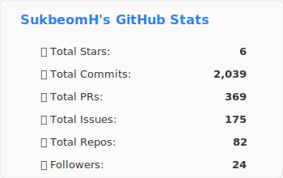
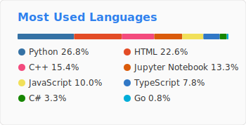

<!-- Header -->

    
    

<!-- Body -->

### **🧑‍💻 Lang and Frameworks**

### **🗄️ Data and DB**

### **🛠️ Infra and Tools**

## 경력 및 프로젝트

### 📖 History

- **2014.03 ~ 2020.08** : 중앙대학교 심리학과 졸업

- **2021.04 ~ 2021.12** : 언리얼 XR 개발자 과정 수료 (과기정통부 메디치센터)

- **2022.03 ~ 2022.05** : 코드캠프 백엔드 개발자 양성과정 수료

- **2022.05 ~ 2022.07** : 온클(Onkul) 기업협업 — 온라인 강의 플랫폼 백엔드

- **2022.07 ~ 2023.12** : (주) ACGR 백엔드 개발자로 근무

- **2024** : 우리금융그룹 우리FIS 아카데미 AI 엔지니어링 3기 수료

### **Working**
- **2025.01 ~** : SK AX · Cloud/Infra Engineer (EnableX Platform팀) **Now 🖐️**

### 🚀 Projects

**2022.05 ~ 2022.07** | **온라인 동영상 강의 플랫폼 백엔드**

- 온클(Onkul) 기업협업 — Node.js, NestJS, TypeScript, MySQL

- 주요역할: 백엔드 서버 개발, 관리자 서비스 구축

- Jest 유닛 테스트로 코드 품질 유지

**2022.07 ~ 2023.12** | **인적성 검사 플랫폼 (ACGR)**

- 오프라인 검사를 온라인으로 전환하는 플랫폼 설계·개발·운영

- NestJS, TypeScript, MariaDB — DB 설계, RESTful API, Docker CI/CD

- Java → Node.js 이관 및 성능 개선

- ELK Stack 모니터링, PDF/Excel 변환 기능 개발

**2024.10 ~ 2024.12** | **우대리(Woodaeri) — RAG 챗봇 대직원 서비스**

- 우리FIS 아카데미 최종 프로젝트 (6인 팀)

- 전체 아키텍처 설계, RAG 백엔드, 배포 담당

- Django, OpenSearch 벡터 검색, Airflow, Docker/AWS

- **우리 FIS 아카데미 3기 최종 우승**

**2025.01 ~** | **클라우드 플랫폼 개발 (SK AX)**

- Kubernetes 기반 클라우드 플랫폼 기능 개발 및 운영

- Go, Python, Vue.js — Admission Webhook, LLM Gateway, AI 에이전트 백엔드

- RAG 파이프라인 설계·개발, 모델 서빙 인프라 구축

### 🧪 Side Projects

- [**HExoskeleton**](https://github.com/SukbeomH/HExoskeleton) (2026.01 ~) — AI 에이전트 기반 개발 방법론 프레임워크 — 순수 bash + 마크다운

- [**RAG-Bench**](https://github.com/SukbeomH/RAG-Bench) (2026.02 ~) — RAG 파이프라인 벤치마크 프레임워크 — 임베딩 모델/PDF 파서/검색 전략 비교

### 📌 Pinned Repositories

- [**tech-seminar-final**](https://github.com/SukbeomH/tech-seminar-final) — Woori FIS Academy Tech Seminar Final ⭐ 0

- [**AI-Chat-Bot-Proj**](https://github.com/woori-fisa-ai-final/AI-Chat-Bot-Proj) — 🚧🚧 우리 FIS 아카데미 최종 프로젝트 🚧🚧 ⭐ 0

#### [📝 \[EKS\] status.Phase: Invalid value: &#34;Active&#34;: may only be &#39;Terminating&#39; if `deletionTimestamp` is not empty](https://veritasgarage.tistory.com/286) 

#### [📝 \[K8s\] 기계는 죽지 않는다, 다만 다시 뜰 뿐](https://veritasgarage.tistory.com/285) 

#### [📝 \[K8s\] 개요, 키워드, 총정리](https://veritasgarage.tistory.com/284) 

#### [📝 RSS 피드를 사용하여 Github 프론트 페이지 자동 업데이트](https://veritasgarage.tistory.com/283) 

#### [📝 \[ML\] 통계 기초 :: 추론 통계](https://veritasgarage.tistory.com/282) 

#### [📝 \[ML\] 통계 개념 기초 :: 기술통계](https://veritasgarage.tistory.com/281) 

#### [📝 \[WEB_HTTP\] Cookie와 Session](https://veritasgarage.tistory.com/280) 

#### [📝 \[RAG\] RAG와 ELK](https://veritasgarage.tistory.com/279) 

#### [📝 \[Python\] Django Basics](https://veritasgarage.tistory.com/278) 

#### [📝 \[AI번역\] SIMD 명령어로 벡터 검색 가속화](https://veritasgarage.tistory.com/277) 

